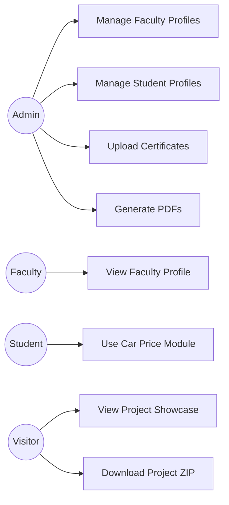
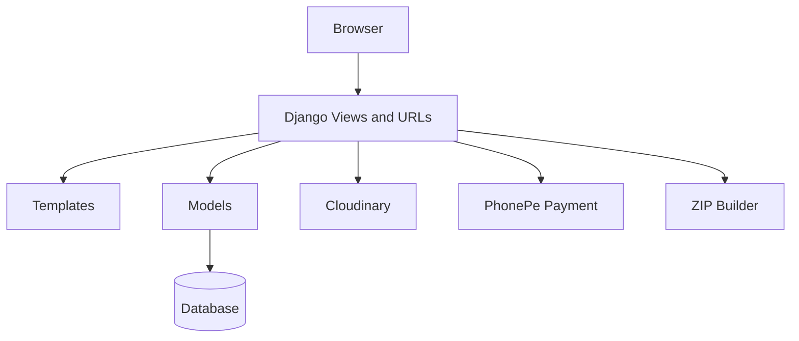
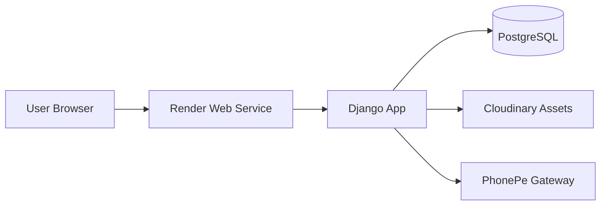

# UML Diagrams

These Mermaid diagrams can be pasted into any Mermaid-enabled editor.

## Use Case Diagram

```mermaid
flowchart LR
    Admin((Admin))
    Faculty((Faculty))
    Student((Student))
    Visitor((Visitor))

    Admin --> ManageFaculty[Manage Faculty Profiles]
    Admin --> ManageStudents[Manage Student Profiles]
    Admin --> UploadCertificates[Upload Certificates]
    Admin --> GeneratePDF[Generate PDFs]
    Visitor --> ViewProjects[View Project Showcase]
    Visitor --> DownloadZip[Download Project ZIP]
    Student --> CarPrice[Use Car Price Module]
    Faculty --> ViewProfile[View Faculty Profile]
```

## Component Diagram

```mermaid
flowchart TB
    Browser[Browser]
    Django[Django Views and URLs]
    Templates[Templates]
    Models[Models]
    DB[(Database)]
    Cloudinary[Cloudinary]
    Payments[PhonePe Payment]
    ProjectZip[ZIP Builder]

    Browser --> Django
    Django --> Templates
    Django --> Models
    Models --> DB
    Django --> Cloudinary
    Django --> Payments
    Django --> ProjectZip
```

## Deployment Diagram

```mermaid
flowchart LR
    User[User Browser] --> Render[Render Web Service]
    Render --> Django[Django App]
    Django --> Postgres[(PostgreSQL)]
    Django --> Cloudinary[Cloudinary Assets]
    Django --> PhonePe[PhonePe Gateway]
```
